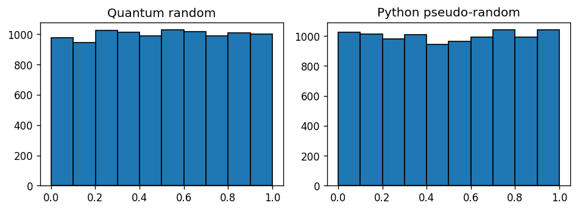

# Visualise and test if the quantum randoms are uniformly distributed in [0.0, 1)

Calling `qrandom.random()` 10,000 times, and comparing it to `random.random()`:

The [Kolmogorov–Smirnov statistics][kstest] with the reference distribution
`scipy.uniform` gives the following results.

| Trial | Quantum statistic | Quantum p-value | Standard statistic | Standard p-value |
| ----- | ----------------- | --------------- | ------------------ | ---------------- |
| 1     | 0.01              | 0.2             | 0.005              | 0.9              |
| 2     | 0.007             | 0.7             | 0.005              | 1.0              |
| 3     | 0.006             | 0.9             | 0.008              | 0.6              |

Each trial is a different run of [`scipy.stats.kstest`][scipy-kstest] with
10,000 numbers. The plot shows the numbers for the last trial.

[kstest]: https://en.wikipedia.org/wiki/Kolmogorov%E2%80%93Smirnov_test
[scipy-kstest]: https://docs.scipy.org/doc/scipy/reference/generated/scipy.stats.kstest.html
